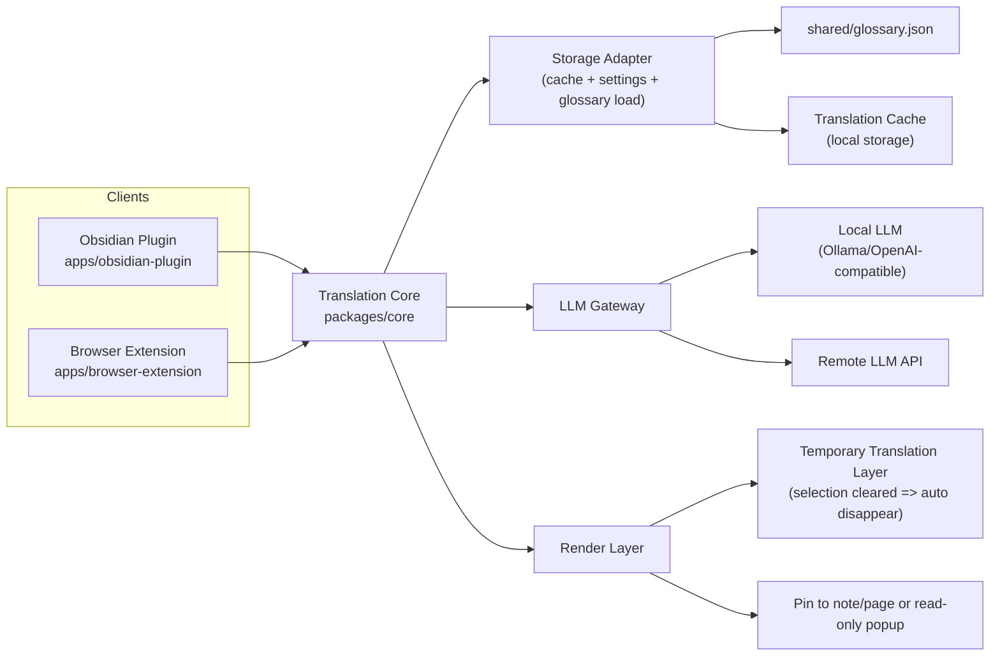

# LLM Translator MVP

Monorepo for the MVP translation workflow used by the Obsidian plugin and browser extension.

## Start Here

1. Read the setup guide: [docs/setup.md](docs/setup.md)
2. Run the smoke test checklist: [docs/mvp-manual-smoke-test.md](docs/mvp-manual-smoke-test.md)
3. Verify the repo with:
   - `npm run check:docs`
   - `npm test`
   - `npm run build`

## Repo Layout

- `packages/core` shared translation logic
- `apps/obsidian-plugin` Obsidian plugin (manifest + runtime entry + adapter layer)
- `apps/browser-extension` browser extension (background + content script + popup trigger/config)
- `shared/glossary.json` default glossary data

## Architecture

## Current UX

- Right-click translation for selected text on both Obsidian and browser
- Temporary translation layer that disappears when selection is cleared
- Pin action to keep translation in note/page
- PDF selection translation via read-only popup (no writeback)

## Docs

- Setup: [docs/setup.md](docs/setup.md)
- Manual smoke test: [docs/mvp-manual-smoke-test.md](docs/mvp-manual-smoke-test.md)
