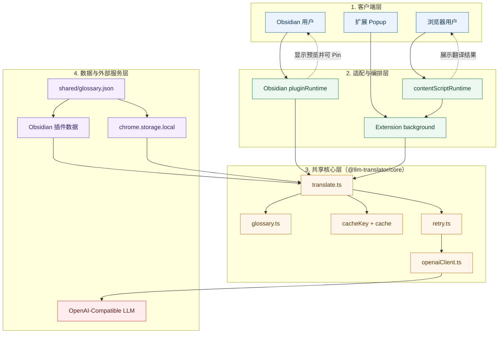

```mermaid
flowchart TB
  subgraph L1["1. 客户端层"]
    direction LR
    OUser["Obsidian 用户"]
    BUser["浏览器用户"]
    Popup["扩展 Popup"]
  end

  subgraph L2["2. 适配与编排层"]
    direction LR
    ORuntime["Obsidian pluginRuntime"]
    CS["contentScriptRuntime"]
    BG["Extension background"]
  end

  subgraph L3["3. 共享核心层（@llm-translator/core）"]
    direction LR
    T["translate.ts"]
    G["glossary.ts"]
    K["cacheKey + cache"]
    R["retry.ts"]
    C["openaiClient.ts"]
  end

  subgraph L4["4. 数据与外部服务层"]
    direction LR
    Glossary["shared/glossary.json"]
    OData["Obsidian 插件数据"]
    CData["chrome.storage.local"]
    LLM["OpenAI-Compatible LLM"]
  end

  OUser --> ORuntime
  BUser --> CS
  Popup --> BG
  CS --> BG

  ORuntime --> T
  BG --> T

  T --> G
  T --> K
  T --> R
  R --> C
  C --> LLM

  Glossary --> OData
  Glossary --> CData
  OData --> T
  CData --> T

  CS -. 展示翻译结果 .-> BUser
  ORuntime -. 显示预览并可 Pin .-> OUser

  classDef client fill:#EAF4FF,stroke:#2F6EA6,color:#12344D,stroke-width:1px;
  classDef adapter fill:#EAF8F0,stroke:#2E7D4F,color:#173D2A,stroke-width:1px;
  classDef core fill:#FFF5E8,stroke:#C77D2B,color:#5B3A10,stroke-width:1px;
  classDef data fill:#F3EDFF,stroke:#6E56CF,color:#352666,stroke-width:1px;
  classDef external fill:#FFECEC,stroke:#C84B4B,color:#5C1F1F,stroke-width:1px;

  class OUser,BUser,Popup client;
  class ORuntime,CS,BG adapter;
  class T,G,K,R,C core;
  class Glossary,OData,CData data;
  class LLM external;

```